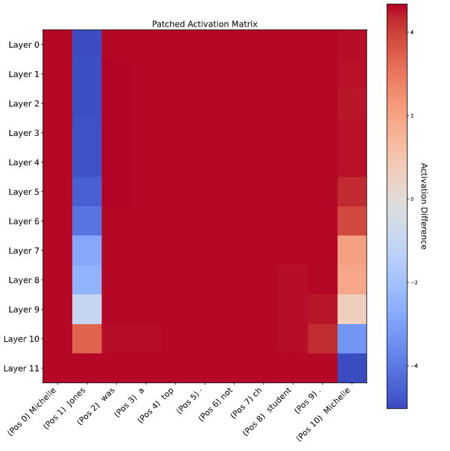

# Repository Summary: Mechanistic Interpretability Practices on Transformers

This repository focuses on mechanistic interpretability in artificial intelligence, particularly attempting to provide motivated explanations for the functioning of machine learning models. Mechanistic interpretability is a crucial proposal for generating trust in AI systems and inducing certain behaviors. There is a range of techniques applicable to transformers within the field of mechanistic interpretability, and this practice will concentrate on activation patching.

Activation patching involves intervening on a specific model's activation by replacing a corrupted activation with a clean one. The impact on the model's output is then measured, allowing us to identify which activations are critical for the model's outcome and to pinpoint potential causes of prediction errors.

Specifically, you will write code that runs the smallest version of GPT-2 (using the string 'gpt2' in the code) with two different inputs: two texts differing by only a single token. By providing the model with the corrupted input, we intervene after a certain layer (one at a time) and patch it with the corresponding embedding from the clean run. We then measure the change in the prediction of the next token relative to the clean execution. If there is a significant change, we can be sure that the activation we altered is important for the prediction. This patching process is performed for each model layer and each token of the input. With all this information, we will produce a graph and draw conclusions. Due to reasons you will understand in a moment, the two texts must have the same number of tokens.

## Example Analysis

To better understand, consider the input text: "Michelle Jones was a top-notch student. Michelle". If we provide this to GPT-2 and study the model's probability for the next token after the second "Michelle", we see the following probabilities for the top 20 tokens:

```plaintext
Position Token index  Token  Probability
1           373        was     0.1634
2           5437       Jones   0.1396
```

As expected, the token "Jones" is notably probable. Now, consider the corrupted input "Michelle Smith was a top-notch student. Michelle". After giving this to GPT-2, we expect a much lower probability for "Jones" and a higher one for "Smith". We aim to identify which embeddings most influence this difference. Since both inputs have 11 tokens and GPT-2's transformer has 12 layers, we focus on the embeddings output from each layer, allowing us to patch 11×12 = 132 different embeddings. We will calculate the difference between the logits for "Smith" and "Jones" at the last token's output ("Michelle") in the corrupted model 132 times.

The heatmap representation of the result is as follows:



Remember that in a chart like this, due to the attention mask and the arrangement of the layers, the information flows from left to right and from top to bottom. The first column's intervention has no effect on predicting the next token, as expected, since the patched embeddings have precisely the same values in both the clean and corrupted models, as the preceding context is the same. However, notice how intervening in the embeddings of many layers for the second token, the prediction shifts towards "Jones". Altering the embeddings of the final layers of the second token has much lesser effects, as the embedding can barely influence the future of the sequence. In the last position ("Michelle"), it's observed that the final layers' embeddings are anticipating the token to predict.

Additional corrupted texts worth exploring could be "Jessica Jones was a top-notch student. Michelle" or "Michelle Smith was a top-notch student. Jessica".

